# Kueri Komersial
Pada tugas ini, saya mempraktikkan nya menggunakan MySQL. Tugas ini diserahkan dalam bentuk tulisan di kertas, saya mencoba menerapkannya secara langsung untuk meningkatkan pemahaman saya tentang kueri dan penggunaan database.

**Tools**  

[](https://skillicons.dev)

- Tabel MHS

| NPM      | NAMA_MHS    | KOTA    |
| -------- | ----------- | ------- |
| 10109832 | Nurhayati   | Jakarta |
| 10109126 | Astuti      | Jakarta |
| 32105500 | Budi        | Depok   |
| 41200525 | Prananigrum | Bogor   |
| 50409486 | Pipit       | Bekasi  |
| 21109353 | Quraish     | Bogor   |
| 10109001 | Fintri      | Depok   |
| 21108002 | Julizar     | Jakarta |

- Tabel NILAI

| NPM      | KDMK  | MID | FINAL |
| -------- | ----- | --- | ----- |
| 10109832 | KK021 | 60  | 75    |
| 10109126 | KD132 | 70  | 90    |
| 32105500 | KK021 | 55  | 40    |
| 41200525 | KU122 | 90  | 80    |
| 21109353 | KU122 | 75  | 75    |
| 50409486 | KD132 | 80  | 0     |

- Tabel MATKUL

| KD_MK | NAMA_MK                    | SKS |
| ----- | -------------------------- | --- |
| KK021 | Sistem Basis Data          | 2   |
| KD132 | Sistem Informasi Manajemen | 3   |
| KU122 | Pancasila                  | 2   |

<br>

#### 1. Tampilkan nilai final tertinggi
```sql
SELECT
  MAX(FINAL) AS 'nilai final tertinggi'
FROM
  NILAI;
```
_output:_  


<br>

#### 2. Tampilkan nilai final terendah
```sql
SELECT
  MIN(FINAL) AS 'nilai final terendah'
FROM
  NILAI;
```
_output:_


<br>

#### 3. Tampilkan rerata dari nilai MID dan FINAL
```sql
SELECT
  AVG(MID) AS 'rerata nilai MID',
  AVG(FINAL) AS 'rerata nilai FINAL'
FROM
  NILAI;
```
_output:_

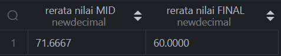

<br>

#### 4. Menampilkan nama yang mengandung hurus a kecil
```sql
SELECT
  *
FROM
  MHS
WHERE
  NAMA_MHS LIKE '%a%';
```
_output:_

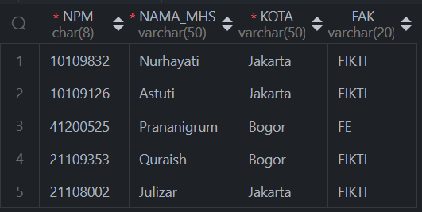

<br>

#### 5. Tampilkan npm , kd_mk,mid untuk nilai mid antara 70 sd 90
```sql
SELECT
  NPM,
  KDMK,
  MID
FROM
  NILAI
WHERE
  MID BETWEEN 70 AND 90;
```
_output:_

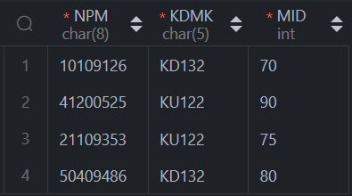

<br>

#### 6. Tampilkan npm, nm_mhs, kd_mk ,final untuk semua mahasiswa
```sql
SELECT
  MH.NPM,
  MH.NAMA_MHS,
  NL.KDMK,
  NL.FINAL
FROM
  MHS AS MH
  INNER JOIN NILAI AS NL ON NL.NPM = MH.NPM;
```
_output:_

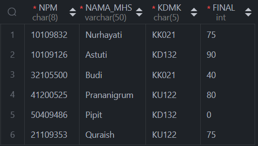

<br>

#### 7. Tampilkan npm, kd_mk ,nama_mk, mid, final  untuk semua mahasiswa
```sql
SELECT
  MH.NPM,
  NL.KDMK,
  MK.NAMA_MK,
  NL.MID,
  NL.FINAL
FROM
  MHS AS MH
  INNER JOIN NILAI AS NL ON NL.NPM = MH.NPM
  INNER JOIN MATKUL AS MK ON NL.KDMK = MK.KD_MK;
```
_output:_

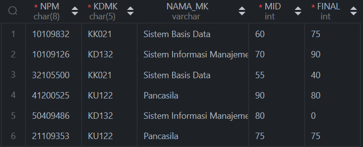

<br>

#### 8. Tampilkan npm, nama mhs, kd_mk ,nama_mk, mid, final  untuk semua mahasiswa
```sql
SELECT
  MH.NPM,
  MH.NAMA_MHS,
  NL.KDMK,
  MK.NAMA_MK,
  NL.MID,
  NL.FINAL
FROM
  MHS AS MH
  INNER JOIN NILAI AS NL ON NL.NPM = MH.NPM
  INNER JOIN MATKUL AS MK ON NL.KDMK = MK.KD_MK;
```
_output:_

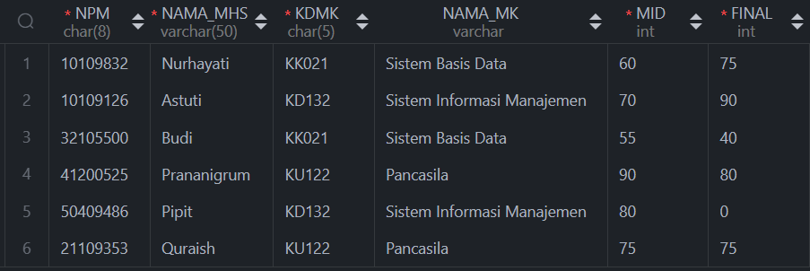

<br>

#### 9. Tampilkan nm_mhs, nama_mk,  mid, final untuk semua mahasiswa yang  nilai mid>60  dan final>60
```sql
SELECT
  MH.NAMA_MHS,
  MK.NAMA_MK,
  NL.MID,
  NL.FINAL
FROM
  MHS AS MH
  INNER JOIN NILAI AS NL ON NL.NPM = MH.NPM
  INNER JOIN MATKUL AS MK ON NL.KDMK = MK.KD_MK
WHERE
  NL.MID > 60
  AND NL.FINAL > 60;
```
_output:_

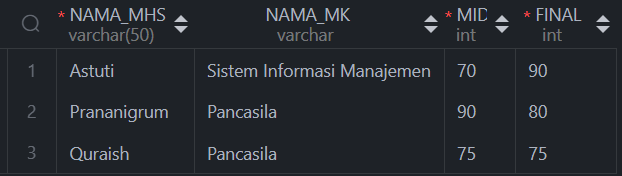

<br>

#### 10. Tambahkan kolom FAK dengan type Varchar dan Panjang 20 pada tabel Mahasiswa
```sql
ALTER TABLE MHS
ADD COLUMN FAK VARCHAR(20);
```
_output:_

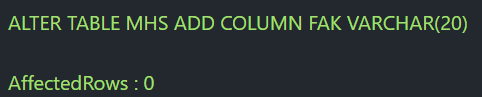

<br>

#### 11. Ubah nilai dari kolom FAK dari ketentuan, ambil 1 digit ke 3 dari NPM
Jika:  
nilainya 1 maka FAK = FIKTI  
nilainya 2 maka FAK = FE  
nilainya 3 maka FAK = FTSP  
nilainya 4 maka FAK = FTI  
nilainya 5 maka FAK = FPSI  
nilainya 6 maka FAK = FSAS  
nilainya 7 maka FAK = FKES  
nilainya 8 maka FAK = FKOMU  
```sql
UPDATE MHS
SET
  FAK = CASE MID(NPM, 3, 1)
    WHEN '1' THEN 'FIKTI'
    WHEN '2' THEN 'FE'
    WHEN '3' THEN 'FTSP'
    WHEN '4' THEN 'FTI'
    WHEN '5' THEN 'FPSI'
    WHEN '6' THEN 'FSAS'
    WHEN '7' THEN 'FKES'
    WHEN '8' THEN 'FKOMU'
  END;
```
_output:_

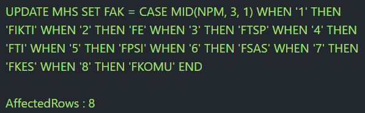

<br>

#### 12. Hitung dan tampilkan jumlah mahasiswa per fakultas.
```sql
SELECT
  FAK,
  COUNT(*) AS 'Jumlah mahasiswa'
FROM
  MHS
GROUP BY
  FAK;
```
_output:_

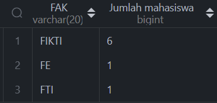

<br>

#### 13. Tampilkan npm, nama, kdmk, mid, final untuk semua mahasiswa, diurutkan berdasarkan nama mahasiswa dari besar ke kecil.
```sql
SELECT
  MH.NPM,
  MH.NAMA_MHS,
  NL.KDMK,
  NL.MID,
  NL.FINAL
FROM
  MHS AS MH
  INNER JOIN NILAI AS NL ON NL.NPM = MH.NPM
ORDER BY
  MH.NAMA_MHS DESC;
```
_output:_

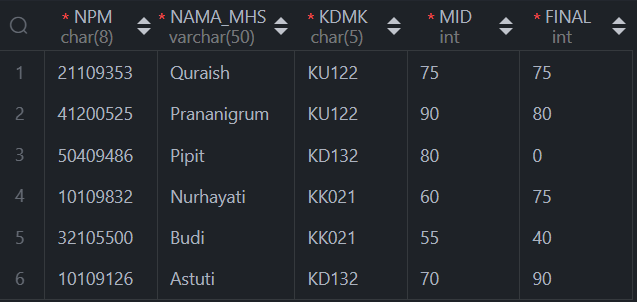

<br>

#### 14. Tampilkan jumlah kdmk, nama matakuliah untuk semua matakuliah yang diambil oleh mahasiswa
```sql
SELECT
  COUNT(MK.KD_MK) AS 'Jumlah kdmk',
  MK.NAMA_MK
FROM
  MHS AS MH
  INNER JOIN NILAI AS NL ON NL.NPM = MH.NPM
  INNER JOIN MATKUL AS MK ON NL.KDMK = MK.KD_MK
GROUP BY
  NL.KDMK,
  MK.NAMA_MK;
```
_output:_

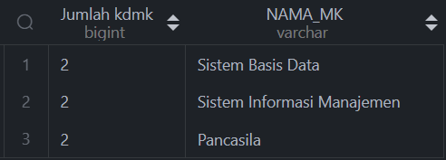

<br>

source code di [sini](source_code.sql)