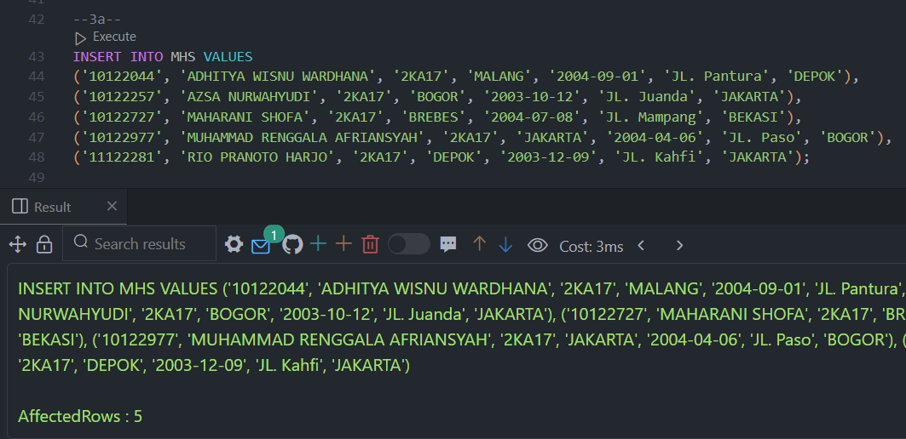
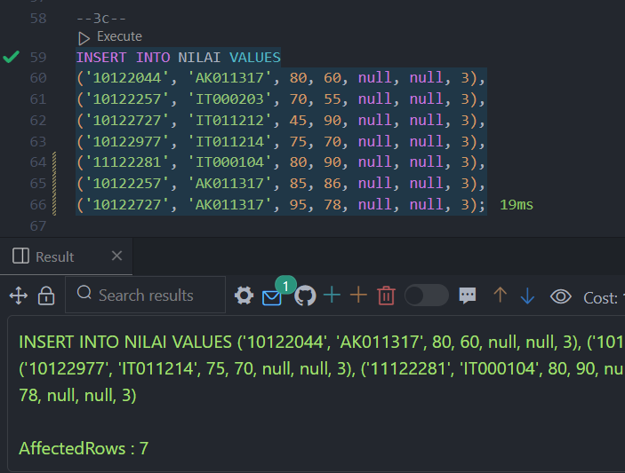
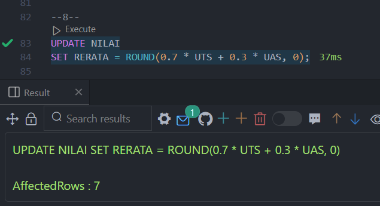
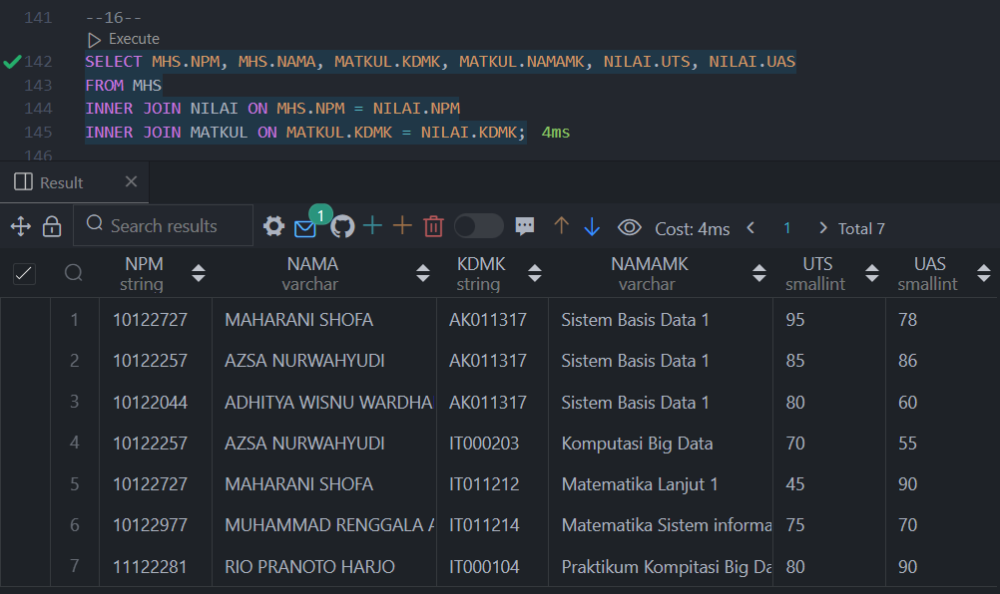
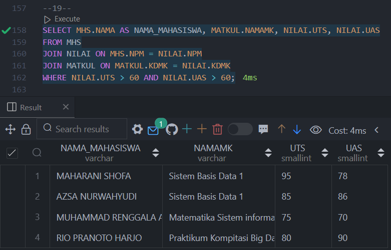
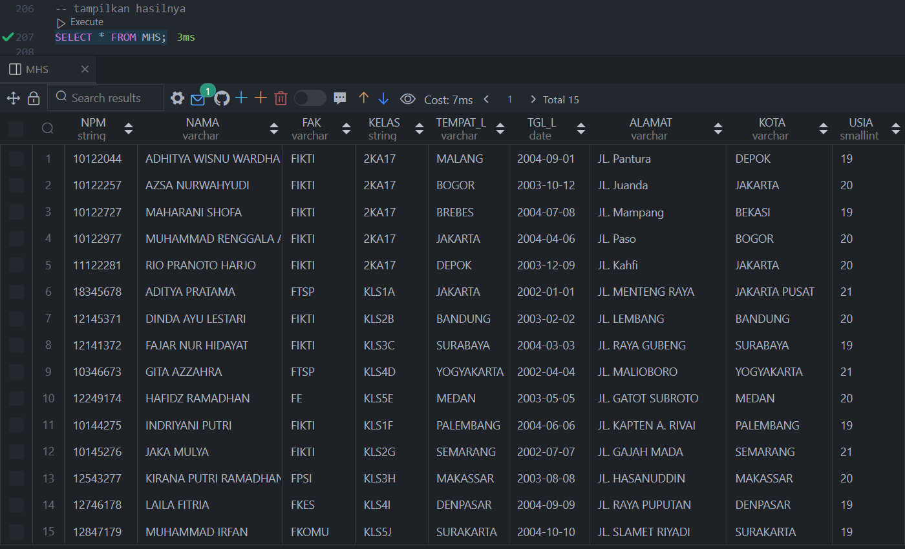
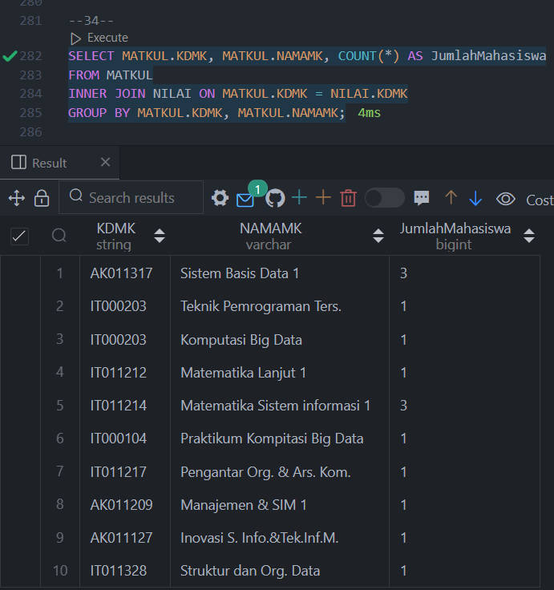
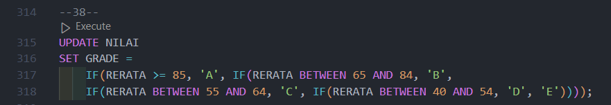
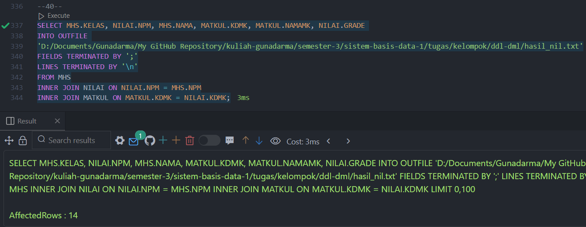

# Tugas Kelompok: DDL dan DML
Latihan Penggunaan Sintaks SQL untuk kueri DDL dan DML

**Anggota kelompok**  
1. ADHITYA WISNU WARDHANA
2. AZSA NURWAHYUDI
3. MAHARANI SHOFA
4. MUHAMMAD RENGGALA AFRIANSYAH
5. RIO PRANOTO HARJO

**Tools yang digunakan**  

[](https://laragon.org/)
[](https://code.visualstudio.com/)

### Soal
#### 1. Buat Database KELAS_kelompok
```sql
CREATE DATABASE 2ka17_kelompok2;
```


#### 2. Gunakan Database KELAS_kelompok, lalu buatlah table :
```sql
USE 2ka17_kelompok2;
```


**a. Tabel MHS**
```sql
CREATE TABLE MHS
( 
  NPM CHAR(8),
  NAMA VARCHAR(40) NOT NULL, 
  KELAS CHAR(5) NOT NULL,
  TEMPAT_L VARCHAR(30),
  TGL_L DATE,
  ALAMAT VARCHAR(30), 
  KOTA VARCHAR(25)
);
```


**b. Tabel MATKUL**
```sql
CREATE TABLE MATKUL
(
  KDMK CHAR(8),
  NAMAMK VARCHAR(30),
  SKS SMALLINT,
  JENIS CHAR(1)
);
```


**c. Tabel NILAI**
```sql
CREATE TABLE NILAI
(
  NPM CHAR(8),
  KDMK CHAR(8),
  UTS SMALLINT,
  UAS SMALLINT,
  RERATA SMALLINT,
  GRADE CHAR(1),
  SEM CHAR(1)
);
```


#### 3. Tambahkan data dengan perintah INSERT untuk setiap table: 
**a. MHS**
```sql
INSERT INTO MHS VALUES
('10122044', 'ADHITYA WISNU WARDHANA', '2KA17', 'MALANG', '2004-09-01', 'JL. Pantura', 'DEPOK'),
('10122257', 'AZSA NURWAHYUDI', '2KA17', 'BOGOR', '2003-10-12', 'JL. Juanda', 'JAKARTA'),
('10122727', 'MAHARANI SHOFA', '2KA17', 'BREBES', '2004-07-08', 'JL. Mampang', 'BEKASI'),
('10122977', 'MUHAMMAD RENGGALA AFRIANSYAH', '2KA17', 'JAKARTA', '2004-04-06', 'JL. Paso', 'BOGOR'),
('11122281', 'RIO PRANOTO HARJO', '2KA17', 'DEPOK', '2003-12-09', 'JL. Kahfi', 'JAKARTA');
```


**b. MATKUL**
```sql
INSERT INTO MATKUL VALUES 
('AK011317', 'Sistem Basis Data 1', 3, 'W'),
('IT000203', 'Komputasi Big Data', 2, 'W'),
('IT011212', 'Matematika Lanjut 1', 2, 'U'),
('IT011214', 'Matematika Sistem informasi 1', 2, 'W'),
('IT000104', 'Praktikum Kompitasi Big Data', 1, 'W');
```


**c. NILAI**
```sql
INSERT INTO NILAI VALUES
('10122044', 'AK011317', 80, 60, null, null, 3),
('10122257', 'IT000203', 70, 55, null, null, 3),
('10122727', 'IT011212', 45, 90, null, null, 3),
('10122977', 'IT011214', 75, 70, null, null, 3),
('11122281', 'IT000104', 80, 90, null, null, 3);
```


#### 4. Tampilkan nilai UAS tertinggi
```sql
SELECT MAX(UAS) FROM NILAI
```


#### 5. Tampilkan nilai UTS terendah
```sql
SELECT MIN(UTS) FROM NILAI;
``` 


#### 6. Tampilkan nilai UAS terendah, UAS tertinggi
```sql
SELECT MIN(UAS) AS UAS_Terendah, MAX(UAS) AS UAS_Tertinggi
FROM NILAI;
```


### 7. Tampilkan nilai rata-rata dari nilai UTS dan UAS
```sql
SELECT MIN(UAS) AS UAS_Terendah, MAX(UAS) AS UAS_Tertinggi
FROM NILAI;
```


#### 8.	Ubah nilai kolom RERATA dengan formula 70% dari UTS + 30% dari UAS
```sql
UPDATE NILAI
SET RERATA = ROUND(0.7 * UTS + 0.3 * UAS, 0);
```


#### 9.	Menampilkan NAMA mahasiswa yang huruf pertamanya 'A' atau yang mengandung huruf 'R'
```sql
SELECT NAMA
FROM MHS
WHERE NAMA LIKE 'A%' OR NAMA LIKE '%R%';
```


#### 10. Menampilkan mahasiswa yang mengandung huruf ‘i’ dan diurut secara descending berdasarkan NAMA 
```sql
SELECT *
FROM MHS
WHERE NAMA LIKE '%i%'
ORDER BY NAMA DESC;
```


#### 11. Tampilkan NPM, KDMK, UTS untuk mahasiswa dengan nilai UTS antara 70 sd 90 (menggunakan  operator logika AND dan menggunakan BETWEEN)
```sql
SELECT NPM, KDMK, UTS
FROM NILAI
WHERE UTS BETWEEN 70 AND 90;
```


#### 12. Menggunakan 2 buah table  
Tampilkan NPM, NAMA, KDMK, UTS untuk mahasiswa dengan nilai UTS antara 70 sd 90 
(menggunakan  operator logika AND) 
Gunakan beberapa perintah join seperti IMPLISIT JOIN, JOIN, INNER JOIN, CROSS JOIN
```sql
SELECT MHS.NPM, MHS.NAMA, MATKUL.KDMK, NILAI.UTS
FROM MHS
CROSS JOIN NILAI
CROSS JOIN MATKUL
WHERE MHS.NPM = NILAI.NPM
  AND MATKUL.KDMK = NILAI.KDMK
  AND NILAI.UTS BETWEEN 70 AND 90;
```


#### 13.	Menggunakan 2 buah table 
Tampilkan NPM, NAMA, KDMK, UTS untuk mahasiswa dengan nilai UTS antara 70 sd 90 
(menggunakan menggunakan BETWEEN) 
Gunakan beberapa perintah join seperti IMPLISIT JOIN, JOIN, INNER JOIN, CROSS JOIN 
```sql
SELECT MHS.NPM, MHS.NAMA, MATKUL.KDMK, NILAI.UTS
FROM MHS, MATKUL, NILAI
WHERE MHS.NPM = NILAI.NPM
  AND MATKUL.KDMK = NILAI.KDMK
  AND NILAI.UTS BETWEEN 70 AND 90;
```


#### 14.	Menggunakan 3 buah table 
Tampilkan NPM, NAMA, KDMK, NAMAMK, UTS untuk mahasiswa dengan nilai UTS antara 70 sd 90 (menggunakan  operator logika AND) 
Gunakan beberapa perintah join seperti IMPLISIT JOIN, JOIN, INNER JOIN, CROSS JOIN 
```sql
SELECT MHS.NPM, MHS.NAMA, MATKUL.KDMK, MATKUL.NAMAMK, NILAI.UTS
FROM MHS
INNER JOIN NILAI ON MHS.NPM = NILAI.NPM
INNER JOIN MATKUL ON MATKUL.KDMK = NILAI.KDMK
WHERE NILAI.UTS >= 70 AND NILAI.UTS <= 90;
```


#### 15. Menggunakan 3 buah table 
Tampilkan NPM, NAMA, KDMK, NAMAMK, UTS untuk mahasiswa dengan nilai UTS antara 70 sd 90 (menggunakan  operator logika BETWEEN) 
Gunakan beberapa perintah join seperti IMPLISIT JOIN, JOIN, INNER JOIN, CROSS JOIN 
```sql
SELECT MHS.NPM, MHS.NAMA, MATKUL.KDMK, MATKUL.NAMAMK, NILAI.UTS
FROM MHS
INNER JOIN NILAI ON MHS.NPM = NILAI.NPM
INNER JOIN MATKUL ON MATKUL.KDMK = NILAI.KDMK
WHERE NILAI.UTS BETWEEN 70 AND 90;
```


#### 16.	Menggunakan 3 buah table Tampilkan NPM, NAMA , KDMK, NAMAMK, UTS, UAS untuk semua mahasiswa
```sql
SELECT MHS.NPM, MHS.NAMA, MATKUL.KDMK, MATKUL.NAMAMK, NILAI.UTS, NILAI.UAS
FROM MHS
INNER JOIN NILAI ON MHS.NPM = NILAI.NPM
INNER JOIN MATKUL ON MATKUL.KDMK = NILAI.KDMK;
```


#### 17. Gunakan perintah operator OR untuk menampilkan semua mahasiswa yang tinggal di kota BEKASI, BOGOR, JAKARTA 
```sql
SELECT NPM, NAMA, KOTA
FROM MHS
WHERE KOTA = 'BEKASI' OR KOTA = 'BOGOR' OR KOTA = 'JAKARTA';
```


#### 18. Gunakan perintah operator IN, untuk menampilkan semua mahasiswa yang tinggal di kota BEKASI, BOGOR, JAKARTA
```sql
SELECT NPM, NAMA, KOTA
FROM MHS
WHERE KOTA IN ('BEKASI', 'BOGOR', 'JAKARTA');
```


#### 19. Tampilkan NAMA mahasiswa, NAMA_MK, UTS,  UAS untuk semua mahasiswa yang nilai UTS>60 dan UAS>60
```sql
SELECT MHS.NAMA AS NAMA_MAHASISWA, MATKUL.NAMAMK, NILAI.UTS, NILAI.UAS
FROM MHS
JOIN NILAI ON MHS.NPM = NILAI.NPM
JOIN MATKUL ON MATKUL.KDMK = NILAI.KDMK
WHERE NILAI.UTS > 60 AND NILAI.UAS > 60;
```


#### 20. Tambahkan kolom FAK alias FAK varchar(30) setelah kolom NAMA pada table MHS
```sql
ALTER TABLE MHS
ADD COLUMN FAK VARCHAR(30) AFTER NAMA;
```


#### 21. Tambahkan Kolom USIA dengan type data smalint pada table MHS
```sql
ALTER TABLE MHS
ADD COLUMN USIA SMALLINT;
```


#### 22. Ubah nilai kolom USIA dengan formula round(datediff(now(),TGL_L/365)) atau fungsi yang lain
```sql
UPDATE MHS
SET USIA = ROUND(DATEDIFF(NOW(), TGL_L) / 365);
```


#### 23. Tampilkan NPM, NAMA, USIA untuk mahasiswa yang memiliki usia lebih kecil dari usia ratarata mhs
```sql
SELECT NPM, NAMA, USIA
FROM MHS
WHERE USIA < (SELECT AVG(USIA) FROM MHS);
```


#### 24. Buat data MHS pada excel atau notepad/wordpad  minimal 10 record dengan nama file mhs1.txt
[](./mhs1.txt)

#### 25. Tambahkan data pada table MHS dari file mhs1.txt dengan perintah  load data  infile 'mhs1.txt' into table mhs fields terminated by ';'  kemudian tampilkan hasilnya
```sql
LOAD DATA INFILE 'mhs1.txt'
INTO TABLE MHS
FIELDS TERMINATED BY ';'
```

Note:   
Ubah path file "mhs1.txt" sesuai dengan tempat penyimpanannya.

**Tampilkan Hasilnya**  


#### 26. Buat data MATKUL pada excel atau notepad/wordpad minimal 5 record dengan nama file mtkul1.txt, kemudian tampilkan hasilnya


#### 27.	Tambahkan data pada table MATKUL dari file mtkul1.txt dengan perintah  load data infile 'mtkul1.txt' into table mhs fields terminated by ';' , kemudian tampilkan hasilnya 
```sql
LOAD DATA INFILE 'mtkul1.txt'
INTO TABLE MATKUL
FIELDS TERMINATED BY ';'
```

Note:   
Ubah path file "mtkul1.txt" sesuai dengan tempat penyimpanannya.

**Tampilkan Hasilnya**  


#### 28. Buat data NILAI pada excel atau notepad/wordpad  minimal 6 record dengan nama file nilai1.txt, kemudian tampilkan hasilnya


#### 29.	Tambahkan data pada table NILAI dari file nilai1.txt dengan perintah  load data local infile 'nilai1.txt' into table mhs fields terminated by ';' , kemudian tampilkan hasilnya 
```sql
LOAD DATA INFILE 'nilai1.txt'
INTO TABLE NILAI
FIELDS TERMINATED BY ';';
```

Note:   
Ubah path file "nilai1.txt" sesuai dengan tempat penyimpanannya.

**Tampilkan Hasilnya**  


#### 30. Ubah nilai dari kolom FAK dari ketentuan, ambil 1 digit ke 3 dari NPM, dengan ketentuan sebagai berikut :   
Nilainya 1 maka fak=FIKTI  
Nilainya 2 maka fak=FE  
Nilainya 3 maka fak=FTSP   
Nilainya 4 maka fak=FTI  
Nilainya 5 maka fak=FPSI  
Nilainya 6 maka fak=FSAS  
Nilainya 7 maka fak=FKES  
Nilainya 8 maka fak=FKOMU  
Gunakan UPDATE kemudian tampilkan hasilnya  
```sql
UPDATE MHS
SET FAK = 'FIKTI'
WHERE SUBSTRING(NPM, 3, 1) = '1';

-- Update FE untuk NPM = '2'
UPDATE MHS
SET FAK = 'FE'
WHERE SUBSTRING(NPM, 3, 1) = '2';

-- Update FTSP untuk NPM = '3'
UPDATE MHS
SET FAK = 'FTSP'
WHERE SUBSTRING(NPM, 3, 1) = '3';

-- Update FTI untuk NPM = '4'
UPDATE MHS
SET FAK = 'FTI'
WHERE SUBSTRING(NPM, 3, 1) = '4';

-- Update FPSI untuk NPM = '5'
UPDATE MHS
SET FAK = 'FPSI'
WHERE SUBSTRING(NPM, 3, 1) = '5';

-- Update FSAS untuk NPM = '6'
UPDATE MHS
SET FAK = 'FSAS'
WHERE SUBSTRING(NPM, 3, 1) = '6';

-- Update FKES untuk NPM = '7'
UPDATE MHS
SET FAK = 'FKES'
WHERE SUBSTRING(NPM, 3, 1) = '7';

-- Update FKOMU untuk NPM = '8'
UPDATE MHS
SET FAK = 'FKOMU'
WHERE SUBSTRING(NPM, 3, 1) = '8';
``` 
  


**Tampilkan Hasilnya**  



#### 31. Sama seperti soal no. 29 tetapi menggunakan CASE WHEN END 
```sql
UPDATE MHS
SET FAK = 
    CASE SUBSTRING(NPM, 3, 1)
        WHEN '1' THEN 'FIKTI'
        WHEN '2' THEN 'FE'
        WHEN '3' THEN 'FTSP'
        WHEN '4' THEN 'FTI'
        WHEN '5' THEN 'FPSI'
        WHEN '6' THEN 'FSAS'
        WHEN '7' THEN 'FKES'
        WHEN '8' THEN 'FKOMU'
        ELSE NULL
    END;
```


#### 32. Sama seperti soal no. 29 tetapi menggunakan IF THEN
```sql
UPDATE MHS
SET FAK = 
    IF(SUBSTRING(NPM, 3, 1) = '1', 'FIKTI', IF(SUBSTRING(NPM, 3, 1) = '2', 'FE',
    IF(SUBSTRING(NPM, 3, 1) = '3', 'FTSP', IF(SUBSTRING(NPM, 3, 1) = '4', 'FTI',
    IF(SUBSTRING(NPM, 3, 1) = '5', 'FPSI', IF(SUBSTRING(NPM, 3, 1) = '6', 'FSAS', 
    IF(SUBSTRING(NPM, 3, 1) = '7', 'FKES', IF(SUBSTRING(NPM, 3, 1) = '8', 'FKOMU', NULL)
)))))));
```


#### 33. Hitung dan tampilkan jumlah mahasiswa per fakultas
```sql
SELECT FAK, COUNT(*) AS JumlahMahasiswa
FROM MHS
GROUP BY FAK;
```


#### 34. Tampilkan jumlah KDMK, NAMA matakuliah untuk semua matakuliah yang diambil oleh mahasiswa
```sql
SELECT MATKUL.KDMK, MATKUL.NAMAMK, COUNT(*) AS JumlahMahasiswa
FROM MATKUL
INNER JOIN NILAI ON MATKUL.KDMK = NILAI.KDMK
GROUP BY MATKUL.KDMK, MATKUL.NAMAMK;
```


#### 35. Tampilkan nilai rerata UTS untuk setiap KDMK 
```sql
SELECT KDMK, ROUND(AVG(UTS), 2) AS RerataUTS
FROM NILAI
GROUP BY KDMK;
```


#### 36. Ubah nilai  GRADE dengan ketentuan : 
GRADE = A : jika RERATA >=85   
GRADE = B : jika RERATA antara 65 sd 84   
GRADE = C : jika RERATA antara 55 sd 64    
GRADE = D : jika RERATA antara 40 sd 54    
GRADE = E : jika RERATA <40  
Gunakan UPDATE
```sql
UPDATE NILAI
SET GRADE = 'A'
WHERE RERATA >= 85;

UPDATE NILAI
SET GRADE = 'B'
WHERE RERATA >= 65 AND RERATA <= 84;

UPDATE NILAI
SET GRADE = 'C'
WHERE RERATA >= 55 AND RERATA <= 64;

UPDATE NILAI
SET GRADE = 'D'
WHERE RERATA >= 40 AND RERATA <= 54;

UPDATE NILAI
SET GRADE = 'E'
WHERE RERATA < 40;
```


#### 37. Sama seperti soal no 36. Gunakan CASE WHEN END 
```sql
UPDATE NILAI
SET GRADE = 
    CASE 
        WHEN RERATA >= 85 THEN 'A'
        WHEN RERATA BETWEEN 65 AND 84 THEN 'B'
        WHEN RERATA BETWEEN 55 AND 64 THEN 'C'
        WHEN RERATA BETWEEN 40 AND 54 THEN 'D'
        ELSE 'E'
    END;
```


#### 38. Sama seperti soal no 36. Gunakan IF THEN 
```sql
UPDATE NILAI
SET GRADE = 
    IF(RERATA >= 85, 'A', IF(RERATA BETWEEN 65 AND 84, 'B',
    IF(RERATA BETWEEN 55 AND 64, 'C', IF(RERATA BETWEEN 40 AND 54, 'D', 'E'))));
```


#### 39. Tampilkan NAMAMK, rata-rata UTS, rata-rata UAS
```sql
SELECT MATKUL.NAMAMK, ROUND(AVG(NILAI.UTS), 2) AS rata_rata_UTS, ROUND(AVG(NILAI.UAS), 2) AS rata_rata_UAS
FROM NILAI
INNER JOIN MATKUL ON NILAI.KDMK = MATKUL.KDMK
GROUP BY MATKUL.NAMAMK;
```


#### 40. Tampilkan KELAS,NPM,NAMA,KDMK,NAMAMK,GRADE di urut ascending berasarkan kolom kemudian simpan dalam file 'hasil_nil.txt' dengan delimiter ';'
```sql
SELECT MHS.KELAS, NILAI.NPM, MHS.NAMA, MATKUL.KDMK, MATKUL.NAMAMK, NILAI.GRADE 
INTO OUTFILE 'hasil_nil.txt'
FIELDS TERMINATED BY ';'
LINES TERMINATED BY '\n'
FROM MHS
INNER JOIN NILAI ON NILAI.NPM = MHS.NPM
INNER JOIN MATKUL ON MATKUL.KDMK = NILAI.KDMK;
```

Note:   
Ubah path file "mtkul1.txt" sesuai dengan tempat penyimpanannya.

#### 41. Tampilkan hasil nmfile.txt dengan menggunakan notepad/wordpad 


File Query di [sini](./2ka17_kelompok2.sql)